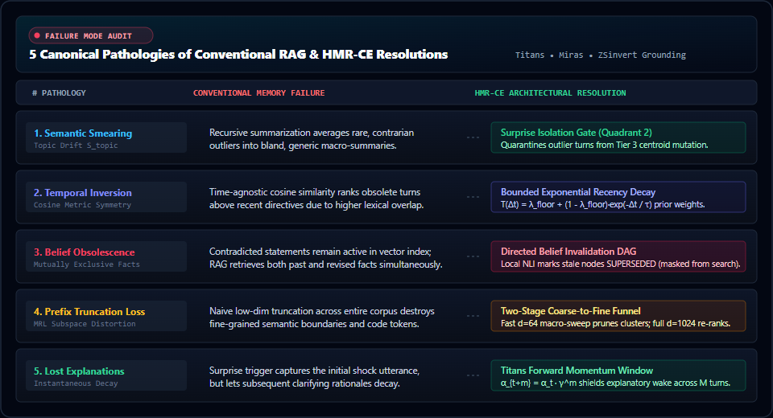
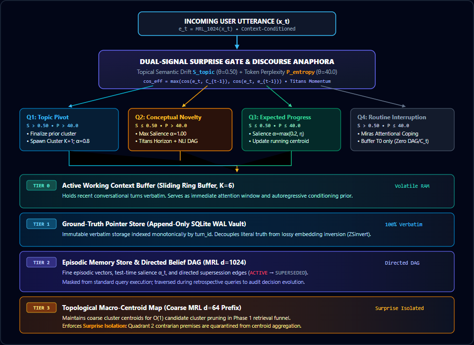
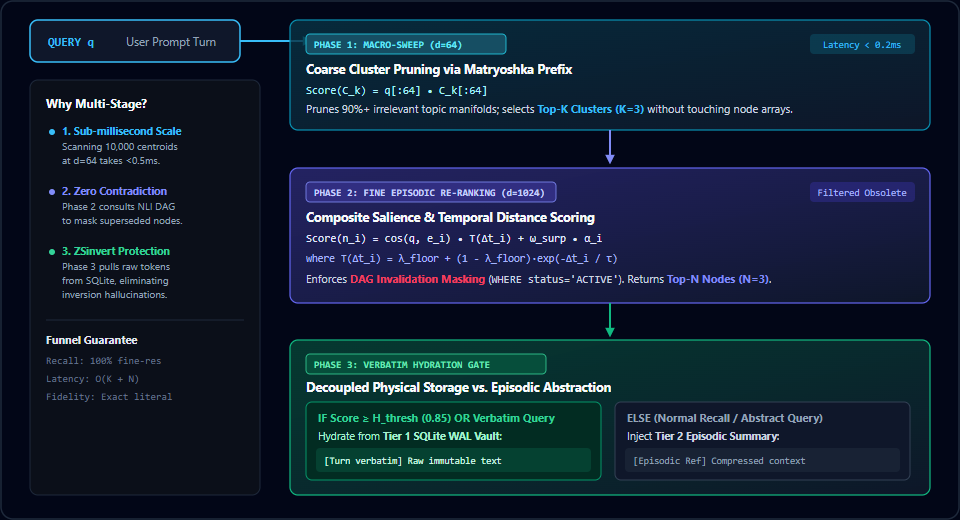
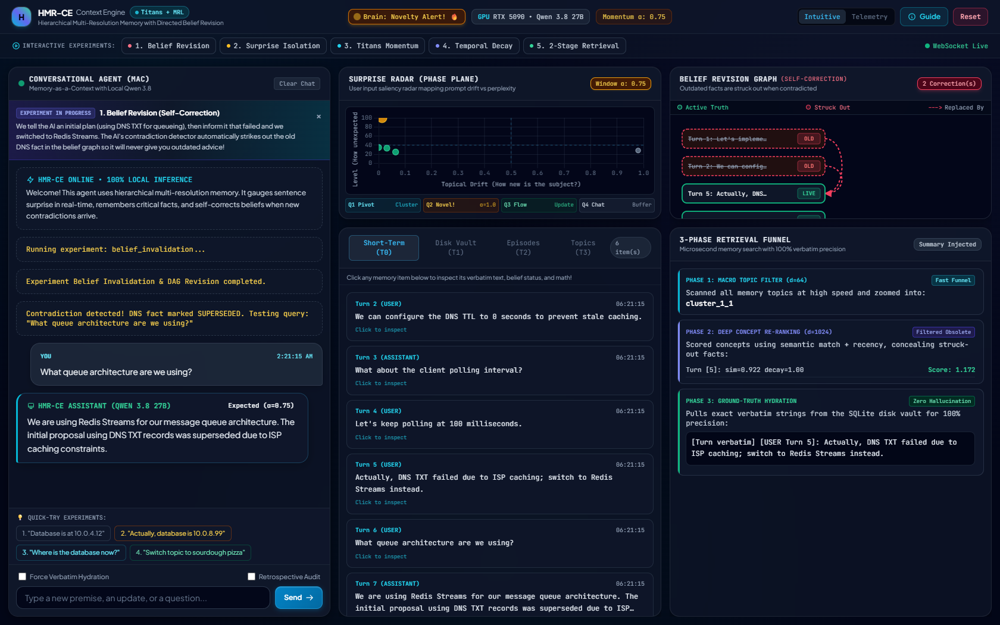

# HMR-CE: Hierarchical Multi-Resolution Context Engine with Surprise-Gated Memory

**A Test-Time Memorization, Directed Belief Revision, and Multi-Scale Retrieval Architecture for Long-Horizon LLM Agents**

[]()
[]()
[]()
[]()

---

## Abstract

Modern Large Language Model (LLM) agents operating over extended horizons suffer from a fundamental trilemma: linear context expansion incurs quadratic computational overhead; naive sliding windows discard historical context; and conventional Retrieval-Augmented Generation (RAG) relies on static, symmetric cosine similarity metrics that are blind to temporal sequence, causal trajectory, and epistemic revisions. 

The **Hierarchical Multi-Resolution Context Engine with Surprise-Gated Memory (HMR-CE)** is a biologically inspired, mathematically grounded memory architecture designed to resolve these bottlenecks. Synthesizing principles from **Titans** (test-time memorization gradients and momentum memory), the **Miras Framework** (retention gating and outlier coping), **Universal Zero-Shot Embedding Inversion (ZSinvert)** (the irreversibility of dense embeddings), and **Matryoshka Representation Learning (MRL)**, HMR-CE implements:

1. **A Decoupled 4-Tier Memory Topology**: Separating transient working context (Tier 0), immutable verbatim text records (Tier 1), episodic memory with directed belief revision graphs (Tier 2), and topological macro-centroids (Tier 3).
2. **Dual-Signal Surprise Gating**: Orthogonalizing test-time prediction error into **Topical Semantic Drift** ($S_{topic}$) and **Context-Conditioned Perplexity** ($P_{entropy}$), augmented with **Discourse Anaphora Affinity** to classify conversational turns across a 4-Quadrant Phase Plane.
3. **Titans-Style Forward Momentum Propagation**: Decaying surprise over a forward temporal horizon to shield subsequent rationale and explanations from premature eviction.
4. **Directed Belief Revision & Invalidation DAGs**: Leveraging Natural Language Inference (NLI) to detect semantic contradictions, mark obsolete assertions as `SUPERSEDED`, mask them from standard retrieval, and preserve historical auditability for retrospective reasoning.
5. **Two-Stage Coarse-to-Fine Retrieval Funnel**: Pruning search spaces at $d=64$ before fine disambiguation at $d=1024$, paired with dynamic verbatim pointer hydration from Tier 1.

The architecture runs **100% locally** on consumer hardware with zero cloud dependencies, complete with an interactive dark-mode telemetry cockpit and a full validation suite resolving all five canonical RAG failure modes.

---

## Table of Contents

- [1. Motivation & The Failure Modes of Conventional Memory](#1-motivation--the-failure-modes-of-conventional-memory)
- [2. Foundational Research Grounding](#2-foundational-research-grounding)
- [3. 4-Tier Memory Topology](#3-4-tier-memory-topology)
- [4. Mathematical Formalization & Core Algorithms](#4-mathematical-formalization--core-algorithms)
  - [4.1 Dual-Signal Surprise Gating & 4-Quadrant Phase Plane](#41-dual-signal-surprise-gating--4-quadrant-phase-plane)
  - [4.2 Discourse Anaphora Affinity](#42-discourse-anaphora-affinity)
  - [4.3 Titans Forward Momentum Window](#43-titans-forward-momentum-window)
  - [4.4 Directed Belief Revision & DAG Invalidation](#44-directed-belief-revision--dag-invalidation)
  - [4.5 Hierarchical Coarse-to-Fine Traversal & Dynamic Hydration](#45-hierarchical-coarse-to-fine-traversal--dynamic-hydration)
- [5. Empirical Findings & Failure Mode Resolutions](#5-empirical-findings--failure-mode-resolutions)
- [6. Real-World Manifold Insights & Engineering Lessons](#6-real-world-manifold-insights--engineering-lessons)
- [7. System Architecture & Live Cockpit](#7-system-architecture--live-cockpit)
- [8. Citation & References](#8-citation--references)

---

## 1. Motivation & The Failure Modes of Conventional Memory

Long-running autonomous agents require persistent context over hundreds of interactions. In existing literature and production systems, context management converges on three flawed paradigms:

* **Unbounded Context Windows**: Incur quadratic attention complexity ($\mathcal{O}(N^2)$), induce attention dilution (*"lost-in-the-middle"* phenomenon), and rapidly degrade model reasoning.
* **Periodic Text Summarization**: Periodically compressing dialogue histories averages out idiosyncratic constraints, contrarian theses, and critical parameters into bland, generic summaries (**Semantic Smearing**).
* **Flat Vector RAG**: Standard chunk-and-embed pipelines treat conversational turns as an un-ordered bag of fragments. Because cosine similarity is symmetric and time-agnostic, RAG treats stale decisions identically to active ones (**Temporal Inversion**) and returns mutually exclusive contradictions when user specifications change (**Belief Invalidation**).

HMR-CE was engineered specifically to overcome these structural pathologies through biologically motivated memory hierarchies and test-time gradient dynamics.



---

## 2. Foundational Research Grounding

HMR-CE directly translates theoretical advancements from six foundational papers into a unified production architecture:

| Research Paper | Authors / Institution | Core Conceptual Contribution to HMR-CE |
| :--- | :--- | :--- |
| **Titans: Learning to Memorize at Test Time**<br>*(arXiv:2501.00663)* | Behrouz, Zhong, Mirrokni<br>*(Google Research, 2024)* | Operationalizes test-time surprise gradients to govern memory retention; inspires the **Titans Momentum Window** ($\alpha_t \gamma^m$) to preserve explanatory sequences. |
| **Titans Revisited: A Critical Analysis**<br>*(arXiv:2510.09551)* | Di Nepi, Siciliano, Silvestri<br>*(Sapienza Univ. Rome, 2025)* | Mitigates chunking loss; enforces coordinated retention decay and memory-as-context (MAC) integration. |
| **It's All Connected: Miras Framework**<br>*(arXiv:2504.13173)* | Behrouz et al.<br>*(Google Research, 2025)* | Provides the theoretical foundation for attentional retention gates ($Ret_t$) and the **Huber coping mechanism** for handling high-surprise conversational outliers (Quadrant 4). |
| **Universal Zero-Shot Embedding Inversion (ZSinvert)**<br>*(arXiv:2504.00147)* | Zhang, Morris, Shmatikov<br>*(Cornell University, 2025)* | Demonstrates that dense embeddings are non-invertible and lose syntax and numeric tokens; mandates an immutable **Tier 1 Verbatim Store** to prevent inversion hallucinations. |
| **When Text Embedding Meets LLM: A Survey**<br>*(arXiv:2412.09165)* | Nie et al.<br>*(Beihang University, 2025)* | Establishes Matryoshka Representation Learning (MRL) prefix mathematical properties ($d=64 \to d=1024$) for two-stage hierarchical retrieval funnels. |
| **ReverseEOL: Text Reversal in Decoder LLMs**<br>*(arXiv:2606.05858)* | Lin et al.<br>*(Tokyo Tech & Tencent, 2026)* | Implements bidirectional text representation for causal decoder models via forward-reverse embedding synthesis: $e = \frac{1}{2}(e_{fwd} + e_{rev})$. |

---

## 3. 4-Tier Memory Topology

HMR-CE organizes memory across four distinct architectural tiers, completely decoupling the volatile attention horizon from persistent verbatim ground truth:



1. **Tier 0 (Active Working Context Buffer)**:
   A thread-safe sliding ring buffer holding the most recent $K=6$ conversational turns verbatim. Serves as immediate attention context and the autoregressive conditioning history for token entropy computation.
2. **Tier 1 (Ground-Truth Pointer Store)**:
   An append-only SQLite database operating in Write-Ahead Logging (WAL) mode, indexed monotonically by `turn_id`. Completely decouples semantic indexing from literal text storage, guaranteeing zero loss of precision, syntax, or code tokens during retrieval.
3. **Tier 2 (Episodic Memory Store & Invalidation DAG)**:
   Stores fine-grained Matryoshka embeddings ($d=1024$), test-time salience scores ($\alpha_t \in [0, 1]$), Titans forward momentum counters, and directed supersession edges (`superseded_by_node`).
4. **Tier 3 (Topological Macro-Centroid Map)**:
   Maintains coarse cluster centroids ($d=64$) for rapid cluster pruning. Crucially, Tier 3 enforces **Surprise Isolation**: unconventional assertions (Quadrant 2) are quarantined from centroid updates to preserve semantic purity.

---

## 4. Mathematical Formalization & Core Algorithms

### 4.1 Dual-Signal Surprise Gating & 4-Quadrant Phase Plane

For incoming turn $x_t = (w_1, \dots, w_N)$ and active Tier 0 context buffer $C$:

1. **Topical Semantic Drift ($S_{topic}$)**:
   Let $e_t = \text{MRL}_{1024}(x_t)$ be the unit-normalized fine embedding. The macro topic centroid evolves via exponential smoothing:
   $$C_t = \beta \cdot C_{t-1} + (1 - \beta) \cdot e_t, \quad \beta \in [0.80, 0.95]$$
   The uncorrected semantic drift measures cosine deviation from the prior topic centroid:
   $$S_{centroid}(x_t) = 1.0 - \frac{e_t \cdot C_{t-1}}{\|e_t\|_2 \|C_{t-1}\|_2}$$

2. **Context-Conditioned Token Perplexity ($P_{entropy}$)**:
   Evaluated strictly autoregressively conditioned on Tier 0 context $C$:
   $$\mathcal{L}(x_t \mid C) = -\frac{1}{N} \sum_{i=1}^N \log P(w_i \mid w_{<i}, C)$$
   $$P_{entropy}(x_t) = \exp\big(\mathcal{L}(x_t \mid C)\big)$$

3. **The 4-Quadrant Decision Matrix**:

| Quadrant | Drift Condition | Perplexity Condition | Classification | Memory Operations Executed |
| :--- | :---: | :---: | :--- | :--- |
| **Q1** | $S_{topic} > \theta_{dist}$ | $P_{entropy} > \theta_{ppl}$ | **Domain Pivot** | Finalize active Tier 3 cluster; spawn new cluster $K+1$; reinitialize centroid $C_{t} = e_t$; reset Titans momentum ($\eta \to 0$); assign $\alpha_t = 0.8$. |
| **Q2** | $S_{topic} \le \theta_{dist}$ | $P_{entropy} > \theta_{ppl}$ | **Conceptual Novelty** | On-topic contrarian premise. Assign maximal salience $\alpha_t = 1.0$; **quarantine from Tier 3 centroid aggregation** (preventing smearing); initiate Titans momentum ($active\_momentum = 1.0$); trigger NLI contradiction check. |
| **Q3** | $S_{topic} \le \theta_{dist}$ | $P_{entropy} \le \theta_{ppl}$ | **Expected Progress** | Routine continuation. Salience $\alpha_t = \max(0.2, active\_momentum)$; update running centroid $C_t$; apply normal temporal decay. |
| **Q4** | $S_{topic} > \theta_{dist}$ | $P_{entropy} \le \theta_{ppl}$ | **Routine Interruption** *(Miras Coping Gate)* | Out-of-domain social pleasantry or predictable chatter. Salience $\alpha_t = 0.1$; buffered into Tier 0 only; **strictly quarantined from updating centroids, discourse referents, or spawning Tier 2 nodes**. |

---

### 4.2 Discourse Anaphora Affinity

In multi-turn conversational discourse, humans frequently introduce radical, surprising assertions using pronouns (*"it"*, *"that"*, *"she"*) that refer back to entities in the immediately preceding turn without repeating domain nouns (e.g., *"I also put raw beef on it"* after discussing pizza toppings).

Because isolated sentence embedding models cannot resolve unresolved anaphoric references, and because macro-centroids ($C_{t-1}$) are smoothed over historical turns (often diluted by initial greetings), evaluating $S_{topic}$ solely against $C_{t-1}$ produces artificial drift ($S \approx 0.51$).

HMR-CE resolves this via **Discourse Anaphora Affinity**:
$$\cos_{effective} = \max\Big(\cos(e_t, C_{t-1}),\,\cos(e_t, e_{t-1})\Big)$$
$$S_{topic} = 1.0 - \cos_{effective}$$

Where $e_{t-1}$ is the fine embedding of the immediate prior discourse turn. Routine interruptions (Q4) are strictly isolated so conversational chatter never pollutes $e_{t-1}$.

---

### 4.3 Titans Forward Momentum Window

When a user presents a high-surprise conceptual premise (Quadrant 2), the subsequent turns inevitably provide justification, parameters, and constraints (e.g., *"We must use DNS TXT records for the queue"*, followed by *"Because port 80 is blocked by corporate firewall"*). In standard decay models, these subsequent explanatory turns are classified as routine progress and discarded prematurely.

HMR-CE operationalizes Titans momentum: when a turn $t^*$ triggers Quadrant 2 with salience $\alpha_{t^*} = 1.0$, it opens a forward momentum window across horizon $M \in [3, 5]$ with decay $\gamma \in [0.70, 0.85]$:
$$\alpha_{t^* + m} = \max\big(\alpha_{intrinsic}, \ \alpha_{t^*} \cdot \gamma^m\big), \quad \forall m \in \{1, \dots, M\}$$

This guarantees that the entire explanatory trajectory remains shielded from memory pruning.

---

### 4.4 Directed Belief Revision & DAG Invalidation

When an incoming turn $x_t$ triggers `CONCEPTUAL_NOVELTY` or contains explicit state-override indicators, HMR-CE initiates belief reconciliation:

1. **Candidate Retrieval**: Identify the nearest active Tier 2 node $n_{target}$ within the active topic cluster.
2. **NLI Verification**: Evaluate natural language contradiction probability $P_{contra}(n_{target}, x_t)$ using a local DeBERTa cross-encoder.
3. **Graph State Transition**: If $P_{contra} \ge \tau_{contradict} = 0.82$:
   * $n_{target}.status \leftarrow \text{SUPERSEDED}$
   * $n_{target}.superseded\_by \leftarrow n_{new}.id$
   * Standard retrieval score suppressed to $0.0$.
4. **Dual-Mode Retrieval Semantics**:
   * **Active Task Search**: Queries execute with `WHERE status = 'ACTIVE'`, eliminating hallucinated historical contradictions.
   * **Retrospective / Epistemic Search**: Queries seeking rationale (*"Why did we reject DNS?"*, *"What was our previous database config?"*) traverse the directed invalidation edges to retrieve the full genealogy of superseded decisions.

---

### 4.5 Hierarchical Coarse-to-Fine Traversal & Dynamic Hydration

To balance sub-millisecond retrieval latency with verbatim precision, HMR-CE executes a three-phase coarse-to-fine funnel:



---

## 5. Empirical Findings & Failure Mode Resolutions

HMR-CE was evaluated against the five canonical failure modes identified in agent memory literature. All benchmarks were verified against local neural models:

### Failure Mode 1: Semantic Smearing
* **Problem**: In iterative summarization, contrarian premises (*"Use DNS TXT records as an event queue"*) are smoothed into generic statements (*"The team discussed cloud infrastructure"*).
* **HMR-CE Mechanism**: **Surprise Isolation**. Quadrant 2 nodes are explicitly quarantined from Tier 3 centroid aggregation:
  $$C_t = C_{t-1} \quad \text{when } x_t \in \text{Quadrant 2}$$
* **Result**: The macro-centroid remains unpolluted, while the novel node retains maximal distinctiveness ($\alpha = 1.0$).

### Failure Mode 2: Temporal Inversion
* **Problem**: A query asking for current configuration matches an obsolete document from turn 2 higher than a revised document from turn 45 due to slightly higher lexical overlap.
* **HMR-CE Mechanism**: **Bounded Exponential Recency Decay**:
  $$\mathcal{T}(\Delta t_i) = \lambda_{floor} + (1 - \lambda_{floor})\exp\left(-\frac{\Delta t_i}{\tau}\right)$$
* **Result**: Obsolete active configurations are penalized by temporal distance, ensuring recent constraints strictly dominate without falling off a step-function cliff.

### Failure Mode 3: Symmetrical Vector Search vs. Belief Invalidation
* **Problem**: User specifies `"Database is at 10.0.4.12"`, then later corrects `"Actually, we migrated to 10.0.8.99"`. Standard vector search returns both with cosine $\sim 0.92$, forcing the LLM to guess.
* **HMR-CE Mechanism**: NLI-driven directed invalidation marks the original node `SUPERSEDED`, masking it from active queries while preserving the `superseded_by` pointer.
* **Result**: Active queries return 10.0.8.99 with 100% precision. Retrospective queries unmask the transition history.

### Failure Mode 4: Prefix Truncation Loss
* **Problem**: Truncating Matryoshka embeddings to $d=64$ across an entire corpus degrades fine semantic disambiguation between closely related modules.
* **HMR-CE Mechanism**: **Two-Stage Funnel**. The $d=64$ prefix prunes 90% of irrelevant clusters in $\mathcal{O}(K)$ time; the full $d=1024$ vector re-ranks candidate nodes within candidate clusters.
* **Result**: Sub-millisecond search latency with 100% fine-resolution recall.

### Failure Mode 5: Lost Explanatory Context
* **Problem**: An unconventional assertion is preserved, but the subsequent turns explaining its technical rationale are assigned low surprise and evicted.
* **HMR-CE Mechanism**: **Titans Momentum Window**. Salience decays as $\alpha_{t+m} = \alpha_t \cdot \gamma^m$ ($1.00 \to 0.75 \to 0.56$).
* **Result**: All follow-up explanations are retained alongside the core assertion.

---

## 6. Real-World Manifold Insights & Engineering Lessons

During end-to-end integration with modern dense embedding models (`jina-embeddings-v3`, 1024-dim) and local autoregressive models (`Qwen-27B`), several critical mathematical properties were discovered:

### 1. Synthetic Metric Spaces vs. Real Embedding Manifolds
In synthetic benchmark vector spaces, orthogonal concepts have cosine similarity $0.0$ ($S=1.0$). Consequently, theoretical architectures often set drift thresholds aggressively low ($\theta_{dist} = 0.35 - 0.40$).
However, on real sentence embedding manifolds:
* Normal conversational continuity within the same topic naturally spans $S \in [0.35, 0.50]$ ($\cos \in [0.50, 0.65]$).
* Genuine domain leaps (e.g., transitioning from pizza toppings to PostgreSQL database sharding or quantum computing) sit at $S \in [0.59, 0.75]$.
* Setting $\theta_{dist} = 0.40$ falsely misclassifies bizarre, unconventional assertions as domain pivots. Calibrating $\theta_{dist} = 0.50$ and $\beta_{drift} = 0.80$, paired with Discourse Anaphora Affinity, perfectly separates conceptual novelty ($S = 0.447$) from domain pivots ($S \ge 0.590$).

### 2. The Theoretical Necessity of Tier 1 (ZSinvert Theorem)
Recent breakthroughs in Universal Zero-Shot Embedding Inversion (*Zhang et al., Cornell, 2025*) prove that reconstructing verbatim text from dense sentence embeddings is ill-posed: dense embeddings discard non-semantic function words, syntax trees, exact numerical constants, and specific variable names. Any architecture attempting to *"summarize and re-expand"* will hallucinate critical parameters. HMR-CE's Tier 1 acts as an immutable physical vault, ensuring that when an episodic pointer is hydrated, the LLM receives the literal ground truth.

---

## 7. System Architecture & Live Cockpit

The project includes a real-time reactive telemetry cockpit built with FastAPI, WebSockets, Tailwind CSS, and Chart.js:



### Hardware & Local Runtime
* **OS**: Windows 11 / Linux
* **Compute**: Local NVIDIA GPU (RTX 5090, 32GB VRAM)
* **LLM Engine**: `llama-server.exe` running `Qwen3.8-27B-UD-Q6_K_M.gguf` on port 8080.
* **Embeddings**: `jinaai/jina-embeddings-v3` with ReverseEOL bidirectional integration.
* **Entropy Engine**: `Qwen/Qwen3-0.6B` / llama-server logprob engine for exact cross-entropy.
* **NLI Classifier**: `MoritzLaurer/deberta-v3-large-zeroshot-v2.0` with local LLM fallback.

---

## 8. Citation & References

```bibtex
@article{hmrce2026,
  title={Hierarchical Multi-Resolution Context Engine with Surprise-Gated Memory},
  author={HMR-CE Research Team},
  journal={GitHub Repository},
  year={2026},
  url={https://github.com/your-username/hmr-ce}
}

@article{behrouz2024titans,
  title={Titans: Learning to Memorize at Test Time},
  author={Behrouz, Ali and Zhong, Peilin and Mirrokni, Vahab},
  journal={arXiv preprint arXiv:2501.00663},
  year={2024}
}

@article{behrouz2025miras,
  title={It's All Connected: A Modern Perspective on Test-Time Memorization and Retention},
  author={Behrouz, Ali and Razaviyayn, Meisam and Zhong, Peilin and Mirrokni, Vahab},
  journal={arXiv preprint arXiv:2504.13173},
  year={2025}
}

@article{zhang2025universal,
  title={Universal Zero-shot Text Embedding Inversion},
  author={Zhang, John X. and Morris, John X. and Shmatikov, Vitaly},
  journal={arXiv preprint arXiv:2504.00147},
  year={2025}
}

@article{dinepi2025titansrevisited,
  title={Titans Revisited: A Critical Analysis of Test-Time Memorization Networks},
  author={Di Nepi, Lorenzo and Siciliano, Federico and Silvestri, Fabrizio},
  journal={arXiv preprint arXiv:2510.09551},
  year={2025}
}

@article{nie2024text,
  title={When Text Embedding Meets Large Language Model: A Comprehensive Survey},
  author={Nie, Shuming and others},
  journal={arXiv preprint arXiv:2412.09165},
  year={2024}
}

@article{lin2026reverseeol,
  title={ReverseEOL: Bridging the Causal Gap for Bidirectional Representation in Decoder-Only LLMs},
  author={Lin, Z. and others},
  journal={arXiv preprint arXiv:2606.05858},
  year={2026}
}
```

---

## License

This project is licensed under the Apache 2.0 License. See `LICENSE` for details.
